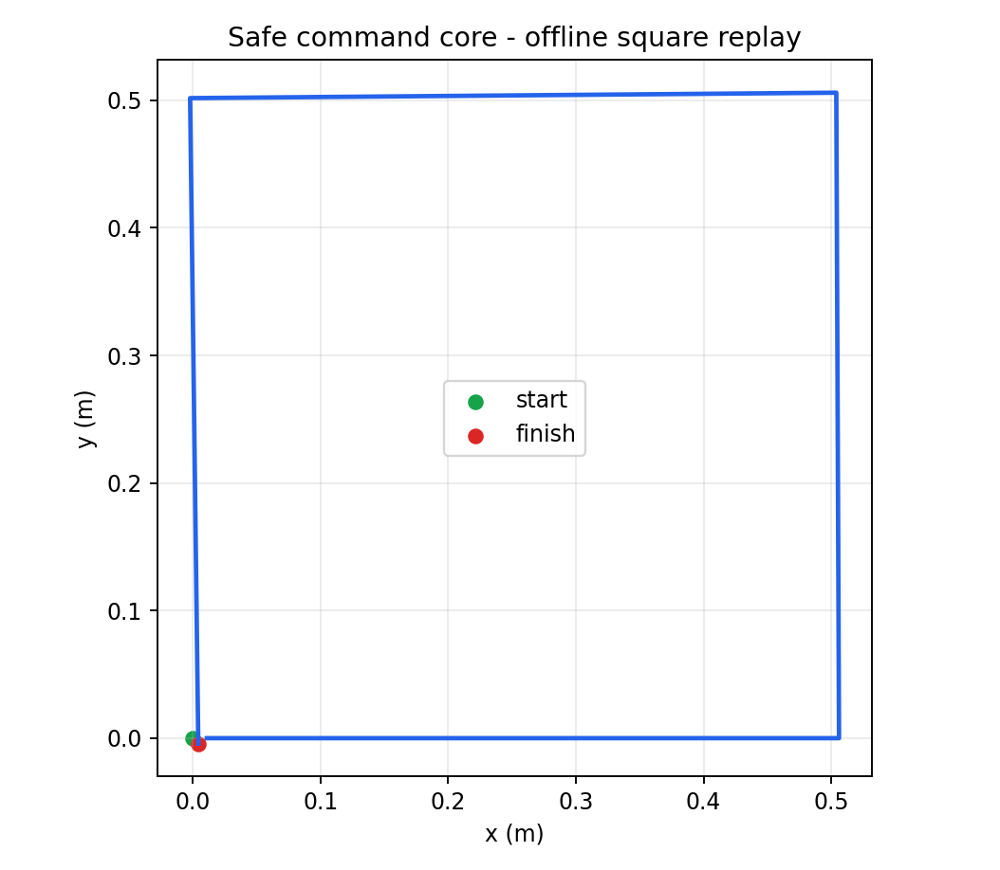
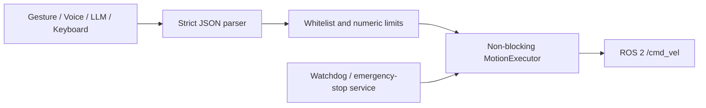

# Safe Multimodal TurtleBot3

A ROS 2 Humble command layer for TurtleBot3 that converts gesture, voice, LLM,
keyboard, or test inputs into a strict JSON motion protocol. This upgrade keeps
the original course-project history while replacing arbitrary Python execution,
blocking motion loops, and hard-coded network addresses.

> Current validation is software-only. This branch does not claim current
> TurtleBot3 hardware, Gazebo, SLAM, Nav2, camera, microphone, or cloud-LLM tests.

## Phase 1 scope

- JSON command protocol shared by gesture, voice, LLM, keyboard, and tests.
- Whitelisted forward/backward/left/right/stop actions with distance and angle limits.
- Non-blocking velocity state machine, watchdog, latched emergency stop, and stop-on-exit.
- ROS 2 topics/services and configurable safety parameters.
- Offline square replay and adversarial-input rejection metrics.
- Python and ROS 2 Humble tests plus GitHub Actions.

## Quantitative offline result

| Metric | Result |
|---|---:|
| Adversarial/invalid payloads rejected | **6 / 6** |
| Maximum commanded linear speed | 0.22 m/s |
| Maximum commanded angular speed | 1.5 rad/s |
| 0.5 m square closure error | **6.0 mm** |
| Final commanded speed | **0.0 m/s** |



The square replay is a deterministic kinematic software evaluation, not a
physical odometry measurement. ROS 2 Humble integration was exercised with a
real node graph: a valid command produced 0.22 m/s on `/cmd_vel`, the emergency
stop service succeeded, and the next observed command was zero linear and
angular velocity.

## Architecture



## Command example

```json
{"source":"llm","commands":[{"action":"forward","value":0.5},{"action":"left","value":90},{"action":"stop"}]}
```

## Python verification

```bash
python3 -m venv .venv
. .venv/bin/activate
python -m pip install -e '.[dev]'
scripts/verify_python.sh
```

## ROS 2 Humble

```bash
scripts/verify_ros2.sh
source install/setup.bash
ros2 launch turtlebot3_multimodal safe_controller.launch.py
```

Publish a structured stop command or use the latched emergency-stop service:

```bash
ros2 topic pub --once /turtlebot3/command std_msgs/msg/String \
  "{data: '{\"source\":\"keyboard\",\"commands\":[{\"action\":\"stop\"}]}' }"
ros2 service call /turtlebot3/emergency_stop std_srvs/srv/Trigger
```

See [the safety model](docs/safety.md) and [legacy migration](docs/migration.md)
before using a physical robot.

## Current limits

- No current TurtleBot3 hardware or actuator validation.
- No Gazebo, SLAM Toolbox, Nav2, obstacle avoidance, or localization in Phase 1.
- No camera, microphone, gesture model, speech API, or cloud LLM integration yet.
- Open-loop duration commands do not compensate for wheel slip or odometry error.
- The software protections are not a certified safety system.

## Original contributors

The initial course prototype was created by [@pgq18](https://github.com/pgq18)
and [@FengDK666](https://github.com/FengDK666). The repository history preserves
that work and attribution.
